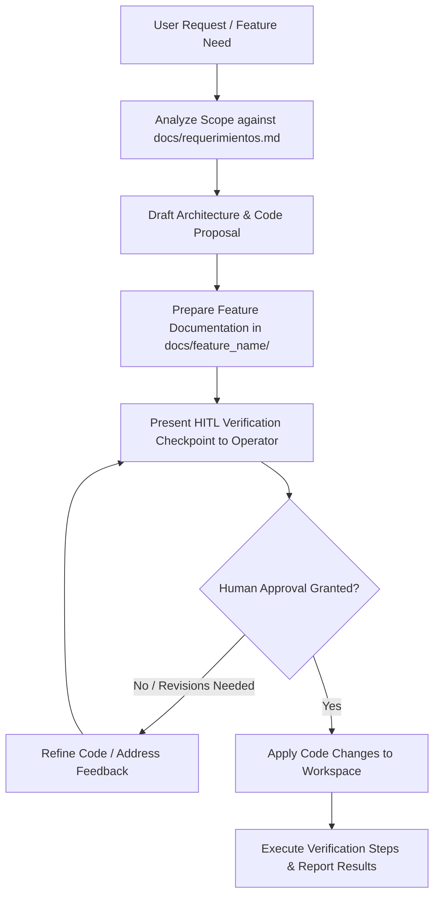

# Punto Casino Platform Engineering Skill

This skill provides the comprehensive engineering blueprint, domain rules, architectural standards, and operational procedures for building the **Punto Casino Universidad** mobile platform using **Python** and **KivyMD**, based directly on [`docs/requerimientos.md`](file:///e:/Rena/ProntoCasino2/docs/requerimientos.md).

---

## 1. Domain Overview & Requirements Matrix

The platform eliminates long cafeteria queues by orchestrating a mobile ordering, reservation, and pickup pipeline between students, guests, cashiers, and store managers.

### 1.1 User Roles & Permissions
| Role | Identifier | Permissions & Capabilities | Access Level |
| :--- | :--- | :--- | :--- |
| **Client** | `client` | Account registration, browse menu, place orders, make payments, receive pickup QR | Authenticated |
| **Guest** | `guest` | Browse menu, immediate cart ordering with upfront payment, no account required | Anonymous / Public |
| **Cashier** | `cashier` | Live order queue reception, accept/confirm or reject orders, toggle item stock | Operator |
| **Admin** | `admin` | Full cashier permissions, system role assignment, sales analytics, reporting | Executive |

### 1.2 Core Data Entities
- **`Product`**:
  - `id_producto`: str (e.g., `"EMPA-01"`, `"BEB-02"`)
  - `name`: str (e.g., `"Empanada de Pino"`)
  - `price`: float / int (e.g., `2000`)
  - `stock`: int (available inventory count)
  - `is_active`: bool (can be disabled by cashier if out of stock)
- **`Order`**:
  - `id_pedido`: str (unique identifier)
  - `customer_name`: str
  - `items`: List of order line items (`id_producto`, `name`, `quantity`, `unit_price`, `subtotal`)
  - `total`: float / int
  - `status`: Enum (`PENDING`, `CONFIRMED`, `REJECTED`, `READY`, `DELIVERED`)
  - `pickup_qr`: Optional[str] (encoded payload for pickup validation)
  - `created_at`: datetime
- **`User`**:
  - `id_usuario`: str
  - `name`: str
  - `email`: Optional[str]
  - `role`: Role Enum (`CLIENT`, `CASHIER`, `ADMIN`, `GUEST`)

### 1.3 Phased Implementation Scope
- **Phase 1: MVP (Active Deliverable)**:
  - Product catalog search and reservation/order placement (Client and Guest).
  - Cashier order queue dashboard with approve/confirm and reject workflows.
  - Real-time stock status visibility.
- **Phase 2: Post-MVP Roadmap**:
  - User authentication and persistent profile management.
  - Daily lunch special (*Menú colación diaria*).
  - Promotional push alerts (e.g., combo discounts).
  - Advanced inventory management with batch replenishment.
  - Product of the day/week highlights.
  - Web browser responsive portal.
  - Sales performance metrics and visual dashboards.

---

## 2. Human-in-the-Loop (HITL) Code Verification Protocol

To protect codebase stability and ensure maximum engineering quality, **every single code suggestion, file modification, or system action must pass through the Human-in-the-Loop checkpoint before application**.



### 2.1 The HITL Proposal Template
Whenever presenting code changes or additions to the user, format your output using the following mandatory template:

```markdown
### 🛡️ Human-in-the-Loop (HITL) Code Verification Checkpoint

#### 1. Target Metadata
- **Target File**: `path/to/module.py`
- **Action**: `[NEW]` | `[MODIFY]` | `[DELETE]`
- **Layer**: `Presentation (KivyMD)` | `Domain / Service` | `Data / Repository` | `Utility`
- **Requirement Reference**: `docs/requerimientos.md` (Section X.X)

#### 2. Architectural Rationale & Impact
- **Why**: Explains why this specific solution satisfies the functional requirement.
- **Impact**: Details dependencies, potential side effects, and state interactions.

#### 3. Proposed Code / Diff
```python
# Full, clean, type-annotated code snippet or precise unified diff
```

#### 4. Human Verification Checklist
- [ ] Requirements check: Satisfies the target criteria in `docs/requerimientos.md`.
- [ ] Typings & Contracts: Complete type annotations and documented parameters.
- [ ] Safe Execution: No unbounded threads or UI thread blocks in Kivy.
- [ ] Error Handling: Gracefully catches and displays errors without app crash.
- [ ] Documentation: Technical specifications documented under `docs/<feature_name>/README.md`.

#### 5. Verification Commands
Instructions for the human operator to test the code using the virtual environment:
`./kivy_env/bin/python main.py`
```

---

## 3. Mandatory Feature Documentation Protocol (`docs/<feature_name>/`)

To ensure long-term maintainability, traceability, and modularity, **every feature must be documented in a dedicated subdirectory within `docs/`**.

### 3.1 Folder Convention
```text
docs/
├── requerimientos.md            # Foundational system requirements
├── TEMPLATE_FEATURE.md          # Standard feature documentation template
└── <feature_name>/              # e.g., docs/order_reservation/
    └── README.md                # Feature specification, date, and technical inner workings
```

### 3.2 Standard Feature Documentation Specification
Each `docs/<feature_name>/README.md` must adhere to the following schema:

```markdown
# Feature: <Nombre de la feature>

- **Fecha**: YYYY-MM-DD
- **Estado**: Planificada | En Desarrollo | En Revisión HITL | Completada
- **Autor / Agente**: Antigravity Punto Casino Engineer
- **Referencia Requerimientos**: docs/requerimientos.md (Sección X.X)

## 1. Descripción y Objetivo
Resumen claro de la funcionalidad y el problema que resuelve en la cafetería.

## 2. Tecnicismos y Arquitectura
- **Módulos y Capas**: Archivos involucrados (Modelos, Repositorios, Servicios, Vistas).
- **Flujo de Datos**: Cómo viaja la información desde la interacción del usuario hasta la persistencia.
- **Transiciones de Estado**: Estados del pedido o inventario modificados por la feature.
- **Componentes KivyMD**: Widgets utilizados (`MDScreen`, `MDCard`, `MDTopAppBar`), eventos enlazados y decoradores.
- **Manejo de Hilos**: Uso de `Clock.schedule_once` o threading para llamadas no bloqueantes.

## 3. Casos Borde y Manejo de Errores
- Comportamiento ante falta de stock.
- Validaciones de entrada (cantidades inválidas, cadenas vacías).
- Caídas de red o fallas en almacenamiento.

## 4. Pruebas y Verificación
Comandos para ejecutar y validar la feature:
\`\`\`bash
./kivy_env/bin/python main.py
\`\`\`
Checklist de verificación funcional paso a paso.
```

---

## 4. Python & KivyMD Architecture Reference

Organize the platform following clean architecture and separation of concerns:

```text
punto_casino/
├── main.py                     # MDApp bootstrap and entry point
├── core/
│   ├── config.py               # Application settings, theme colors, constants
│   └── events.py               # Event buses and notification observers
├── models/
│   ├── product.py              # Product dataclass and inventory validation
│   ├── order.py                # Order dataclass, line items, and state machine
│   └── user.py                 # User and Role dataclasses
├── repositories/
│   ├── base.py                 # Abstract repository interfaces
│   ├── product_repository.py   # Product persistence (In-memory, JSON, SQLite)
│   └── order_repository.py     # Order persistence
├── services/
│   ├── order_service.py        # Order validation, total computation, checkout
│   ├── cashier_service.py      # Order confirmation/rejection, stock toggle
│   └── auth_service.py         # Login, registration, and guest session handling
├── views/
│   ├── screens/
│   │   ├── catalog_screen.py   # Client/Guest product catalog view
│   │   ├── cart_screen.py      # Order review and payment view
│   │   ├── cashier_screen.py   # Cashier order management dashboard
│   │   └── admin_screen.py     # Admin dashboard and metrics
│   └── components/
│       ├── product_card.py     # Custom KivyMD product card widget
│       └── order_item.py       # Cashier queue item card
└── utils/
    ├── qr_generator.py         # QR code string/image generation for pickup
    └── formatters.py           # Currency (CLP) and date formatters
```

### 4.1 Critical Engineering Rules for KivyMD
1. **Never Block the Main UI Thread**:
   - Time-consuming tasks (network calls, heavy file I/O) must execute in background threads.
   - Schedule UI updates back onto the Kivy loop via `from kivy.clock import Clock; Clock.schedule_once(callback)`.
2. **Material Design 3 Consistency**:
   - Utilize standard KivyMD components: `MDApp`, `MDScreen`, `MDTopAppBar`, `MDRaisedButton`, `MDCard`, `MDDialog`, and `MDSnackbar`.
   - Use theme palettes consistently (e.g., `theme_cls.primary_palette = "Orange"`, `theme_cls.accent_palette = "Amber"` for cafeteria warmth).
3. **Screen Management**:
   - Leverage `MDScreenManager` with distinct named screens: `'catalog'`, `'cart'`, `'order_status'`, `'cashier_dashboard'`, `'admin_panel'`.
   - Keep screen transitions decoupled from business logic.

---

## 5. Step-by-Step Implementation Runbook

### Step 1: Feature Scoping & Documentation Initialization
- Create the target folder `docs/<feature_name>/` and initialize `README.md` with date, name, and architecture.
- Map the feature to `docs/requerimientos.md`.

### Step 2: Define Domain Models & Repository Contracts
- Create pure Python models using `@dataclass` under `models/`.
- Ensure immutability or validation rules (e.g., quantity > 0, price >= 0).

### Step 3: Implement Business Logic & Services
- Write pure Python service methods (e.g., order calculation, cashier order queue, inventory toggles).

### Step 4: Construct UI Screens with KivyMD
- Build or extend `MDScreen` subclasses and custom cards.
- Bind user events to service calls without blocking the UI thread.

### Step 5: Execute HITL Verification Checkpoint
- Present the changes to the human reviewer using the Section 2.1 template.
- Review checklist items including the presence of `docs/<feature_name>/README.md`.
- Await operator verification and approval before applying code changes.

### Step 6: Test & Verify
- Run the application via the local virtual environment:
  ```bash
  ./kivy_env/bin/python main.py
  ```
- Verify responsiveness, absence of runtime layout warnings, and correct order lifecycle flow.

---

## 6. Git Discipline & Safety Guidelines

In strict accordance with Section 7 of [`docs/requerimientos.md`](file:///e:/Rena/ProntoCasino2/docs/requerimientos.md):
- **Branch Target**: Work on feature branches or `develop`. Never push directly to `main`.
- **Commit Messages**: Conventional commits format (`feat:`, `fix:`, `refactor:`, `docs:`, `test:`).
- **Daily Push Cadence**: Push completed features after daily development sessions.
- **Pristine Environment**: Keep `.gitignore` updated to exclude `kivy_env/`, `*.pyc`, `__pycache__/`, `.buildozer/`, and `.DS_Store`.

