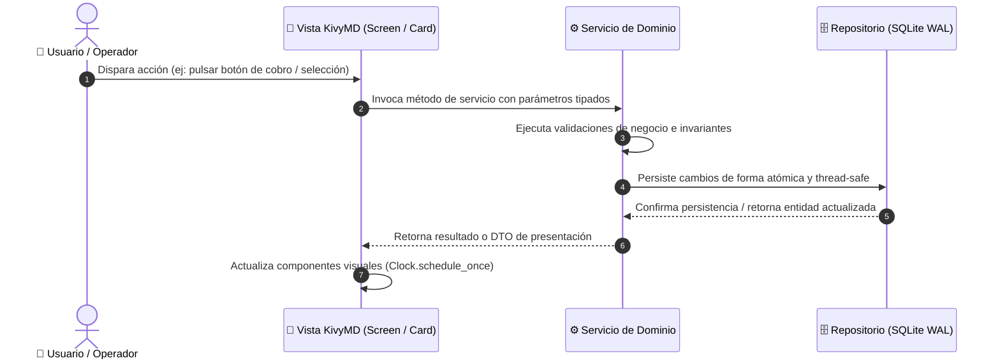
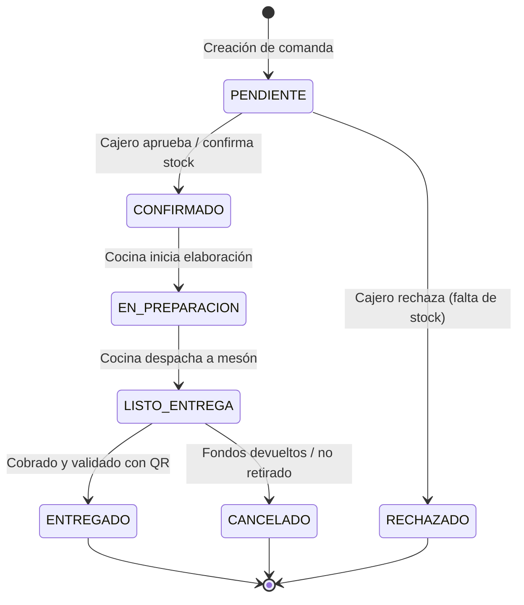

# Plantilla Estándar de Especificación Técnica (RFC / Feature Spec)

```yaml
id_feature: "PC-FEAT-XXX"
nombre: "Nombre de la Característica / Módulo"
version: "1.0.0"
fecha: "AAAA-MM-DD"
estado: "Borrador | En Revisión HITL | Aprobada | Implementada | Deprecada"
autor: "Nombre / Agente Antigravity Punto Casino Engineer"
aprobador_hitl: "Operador / Arquitecto Líder"
impacto: "Menor (UI/UX) | Medio (Lógica/Servicios) | Mayor (Modelo/DB/Seguridad)"
referencia_requerimientos: "docs/requerimientos.md (Sección X.X)"
referencia_expansion_saas: "docs/plan_expansion_universidades_chile/README.md (Hito X)"
```

---

## 1. Resumen Ejecutivo y Valor de Negocio

### 1.1 Declaración del Problema
Descripción concisa de la problemática operativa, de usabilidad o de negocio que esta característica resuelve en el casino universitario (ej: tiempos de espera en fila de mesón, mermas de inventario por productos próximos a vencer, inconsistencia en la cuadratura de caja o dificultades en la autenticación estudiantil).

### 1.2 Valor Aportado y Métrica de Éxito
- **Impacto Operativo**: (ej. Reducción del tiempo promedio de despacho de comandas en un 35%).
- **Impacto Financiero**: (ej. Cero discrepancias entre cobros en efectivo/débito y comandas entregadas).
- **Métricas Clave (KPIs)**:
  - Tiempo de interacción / respuesta en UI (< 100ms).
  - Tasa de éxito en la transacción (> 99.5%).
  - Cero bloqueos (*frame drops*) en el hilo principal de renderizado de Kivy.

### 1.3 Matriz de Roles y Actores Afectados
| Rol de Usuario | Permisos / Interacción con la Feature | Nivel de Acceso |
| :--- | :--- | :--- |
| **Estudiante / Funcionario (Cliente)** | Visualización, selección, reserva y pago | Autenticado |
| **Visita / Externo (Invitado)** | Compra directa sin registro previo con pago inmediato | Público / Anónimo |
| **Cajero de Mesón (`cashier`)** | Recepción de comanda, cobro, validación de entrega y cambio de stock | Operador de Casino |
| **Administrador del Casino (`admin`)** | Gestión de catálogo, precios, ofertas, auditoría contable y métricas | Administrador Local |
| **Administrador Central SaaS** | Configuración multi-sede, asignación de tenancies y convenios institucionales | Administrador Global |

---

## 2. Especificación Técnica y Arquitectura de Software

### 2.1 Capas y Módulos del Sistema
Indica explícitamente los componentes tocados o creados siguiendo la **Arquitectura Limpia en Capas**:

```text
punto_casino/
├── models/          # Entidades puras y reglas de dominio invariantes
├── repositories/    # Persistencia desacoplada (SQLite WAL / PostgreSQL)
├── services/        # Lógica de negocio, cálculos de precio y transiciones
├── views/           # Capa de presentación (MDScreen, MDCard, Material 3)
│   ├── screens/     # Pantallas de la aplicación KivyMD
│   └── components/  # Widgets reutilizables normalizados (botones, tarjetas, badges)
└── utils/           # Validadores de RUT, formateadores CLP y generadores QR
```

- **Modelos de Dominio (`models/`)**: Clases `@dataclass` afectadas (atributos, tipos estrictos, inmutabilidad).
- **Capa de Persistencia (`repositories/`)**: Métodos de acceso a datos, consultas parametrizadas y aislamiento de hilos.
- **Servicios de Aplicación (`services/`)**: Orquestación de lógica de negocio, validaciones y cálculo transaccional.
- **Presentación (`views/`)**: Jerarquía de widgets KivyMD, navegación y enlace de eventos.

### 2.2 Flujo de Datos y Diagrama de Secuencia
Diagrama Mermaid formal que describe el recorrido de los datos entre capas:



### 2.3 Máquina de Estados Finita (FSM)
Define los estados, eventos disparadores y condiciones de guarda para las entidades involucradas:



### 2.4 Diseño de Interfaz y Cumplimiento Material Design 3 (M3)
- **Viewport Objetivo**: Optimizado para smartphones (380x720 dp base, compatible con 360x640 dp mínimo).
- **Reglas KivyMD 2.0 Obligatorias**:
  - `theme_width="Custom"` y `theme_height="Custom"` en botones con dimensiones o `size_hint` específicos.
  - Cero truncamiento de texto: rótulos de navegación vertical con píldora centrada (`create_nav_item`).
  - Tarjetas de selección unificadas (`MDCard` con `style="outlined"`, ícono, subtítulo, valor en negrita y chevron) en sustitución de pares `MDTextField` + `MDButton` desalineados.
  - Badges institucionales para códigos autogenerados del sistema (`id_badge`), evitando cajas de texto deshabilitadas.
  - Zonas táctiles cómodas (*touch targets* mínimos de 48x48 dp).
  - Desacoplamiento de hilos: Todo cómputo o I/O pesado ejecutado en segundo plano con refresco en bucle UI mediante `Clock.schedule_once`.

### 2.5 Esquema de Base de Datos y Persistencia
- **Estrategia**: SQLite 3 en modo `WAL` (*Write-Ahead Logging*) con integridad referencial (`PRAGMA foreign_keys = ON;`).
- **Sentencias DDL / Migraciones**:
```sql
-- Ejemplo de especificación de esquema / cambios
CREATE TABLE IF NOT EXISTS sample_table (
    id TEXT PRIMARY KEY NOT NULL,
    tenant_id TEXT NOT NULL DEFAULT 'uct',
    created_at DATETIME DEFAULT CURRENT_TIMESTAMP
);
CREATE INDEX IF NOT EXISTS idx_sample_tenant ON sample_table(tenant_id);
```

---

## 3. Seguridad, Privacidad y Ecosistema Chileno

### 3.1 Cumplimiento Normativo Chileno
- **Ley N° 19.628 (Protección de Datos Personales)**: Prohibición estricta de almacenar contraseñas en texto plano o exponer datos sensibles en logs.
- **Algoritmo RUT Chileno**: Validación de módulo 11 estricta con formateo institucional (`XX.XXX.XXX-X`).
- **Formato Monetario Nacional**: Valores expresados en Pesos Chilenos (`$X.XXX CLP`) con redondeo sin centavos según normativa del SII.

### 3.2 Seguridad de Aplicación Móvil (OWASP Mobile Top 10)
- **M1 (Almacenamiento Inseguro)**: Sesiones guardadas con tokens cifrados efímeros; hashes de autenticación mediante PBKDF2/bcrypt con sal.
- **M2 (Comunicación Insegura)**: Preparación para mTLS y TLS 1.3 en endpoints distribuidos.
- **M3 (Inyección)**: Todas las consultas a repositorios parametrizadas mediante tuplas; prohibición absoluta de interpolación de strings en SQL.
- **M4 (Control de Acceso / RBAC)**: Verificación estricta de roles en cada invocación de servicio (`client`, `guest`, `cashier`, `admin`).

---

## 4. Matriz de Casos Borde y Resiliencia

| Escenario de Borde | Comportamiento Esperado | Mitigación Técnica |
| :--- | :--- | :--- |
| **Condición de Carrera en Stock** | Dos clientes compran el último plato simultáneamente. | Bloqueo a nivel de repositorio y verificación atómica de saldo de stock antes de confirmar la comanda. |
| **Pérdida de Conexión de Red** | Falla de conectividad wifi del campus universitario. | Manejo defensivo con reintentos exponenciales y almacenamiento en caché local sin bloquear la UI. |
| **Pantalla Angosta (< 360dp)** | Dispositivos móviles compactos o fuentes del sistema ampliadas. | `ScrollView` envolvente con `minimum_height` responsivo y labels con `shorten=True`. |
| **Entradas Malformadas** | Caracteres no numéricos en precios, caracteres de inyección. | Sanitización regex y captura de `ValueError` informando al usuario en banner suave. |

---

## 5. Protocolo de Verificación y Aseguramiento de Calidad (QA)

### 5.1 Verificación Automatizada (Headless Tests)
Comando ejecutable para ejecutar la suite de pruebas en el entorno aislado del proyecto:
```bash
./kivy_env/bin/python -m unittest discover -s tests -p "test_*.py"
```

### 5.2 Checklist de Verificación HITL (Human-in-the-Loop)
- [ ] **Alineación con Requerimientos**: Cumple con la especificación de `docs/requerimientos.md`.
- [ ] **Contratos de Tipado**: 100% de funciones y clases con anotaciones de tipo (`typing`) y docstrings.
- [ ] **Ergonomía de Interfaz**: Sin desbordamientos, textos cortados o parpadeos en resolución 380x720 dp.
- [ ] **Seguridad Verificada**: Parámetros sanitizados, consultas preparadas y control de roles activo.
- [ ] **Documentación Actualizada**: Archivo `docs/<feature_name>/README.md` creado y sincronizado con esta plantilla.

---

## 6. Estrategia de Despliegue y Plan de Rollback

### 6.1 Activación Gradual (*Feature Flagging*)
Mecanismo para activar o desactivar la funcionalidad mediante configuración centralizada (`punto_casino/core/config.py`).

### 6.2 Procedimiento de Rollback (Contingencia)
Pasos sistemáticos para revertir los cambios de forma segura en caso de anomalías en producción sin afectar la base de datos ni los pedidos activos.
