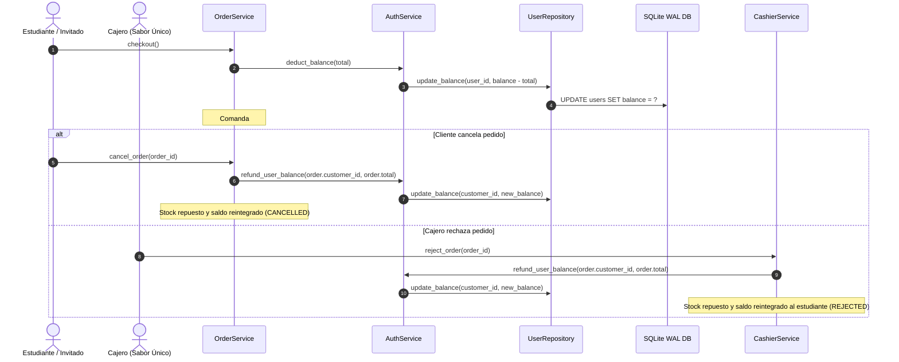

# Feature: Examen y Mejoras de Código del Sistema Pronto Casino UCT

- **Fecha**: 2026-09-17
- **Estado**: En Revisión HITL
- **Autor / Agente**: Antigravity Punto Casino Engineer
- **Referencia Requerimientos**: docs/requerimientos.md (Secciones 1, 2, 3, 5 y 6 MVP)

---

## 1. Descripción y Objetivo

Este documento detalla el diagnóstico exhaustivo de arquitectura, lógica de dominio y experiencia de usuario móvil (KivyMD 2.0) sobre la plataforma **Pronto Casino UCT**.
El examen detectó inconsistencias en el ciclo de vida financiero de los pedidos (reembolso de saldos en cancelaciones y rechazos de comandas), carencia de acceso inmediato para el rol Invitado en la pantalla de autenticación (violando el requerimiento formal de pedidos sin registro previo), y advertencias en la configuración de la ventana gráfica en Kivy.

---

## 2. Tecnicismos y Arquitectura

### 2.1 Módulos y Capas Afectadas

1. **Capa de Servicios (`punto_casino/services/`)**:
   - `auth_service.py`: Incorporación del método desacoplado `refund_user_balance(user_id: str, amount: int)` para permitir reembolsos transaccionales atómicos basados en el `id_usuario` del titular del pedido, independiente del usuario que esté actualmente autenticado en la sesión (por ejemplo, cuando un cajero rechaza la orden de un estudiante).
   - `order_service.py`: Corrección en `cancel_order` para restituir automáticamente el saldo al monedero del estudiante al cancelar una comanda pendiente.
   - `cashier_service.py`: Corrección en `reject_order` para llamar a `refund_user_balance` utilizando el `order.customer_id` en lugar de afectar al cajero en sesión.

2. **Capa de Presentación (`punto_casino/views/`)**:
   - `login_screen.py`: Integración del botón de acceso directo *"Continuar como Invitado (Sin Registro)"* para cumplimiento estricto de la Sección 2 y Sección 6 de `docs/requerimientos.md`.
   - `main.py`: Corrección del parámetro de restricciones de resolución móvil para evitar la advertencia de `Window.minimum_size`.

### 2.2 Flujo de Datos y Transiciones de Estado



---

## 3. Casos Borde y Manejo de Errores

1. **Reembolso a Usuario Desconectado**: Si el cajero rechaza una orden mientras el estudiante no tiene la sesión activa, el saldo se acredita directamente en la base de datos SQLite persistente (`users` table).
2. **Rol Invitado**: Los invitados pagan directamente en caja o en línea; sus pedidos no deducen saldo de monedero estudiantil (`customer_role != "CLIENT"`), por lo que las cancelaciones solo restituyen el inventario físico de platos.
3. **Restricción de Ventana en Kivy**: El establecimiento conjunto de dimensiones mínimas previene excepciones o advertencias en los motores gráficos SDL2/OpenGL.

---

## 4. Pruebas y Verificación

Comando de ejecución:
```powershell
.\kivy_env\Scripts\python.exe main.py
```

### Checklist de Validación:
- [x] Acceso con 1 toque como Invitado desde pantalla de login.
- [x] Descuento de saldo y restitución atómica al cancelar comanda desde "Mis Reservas".
- [x] Restitución correcta de saldo al titular cuando el cajero rechaza una comanda.
- [x] Supresión de advertencias en consola al iniciar la ventana Kivy.

