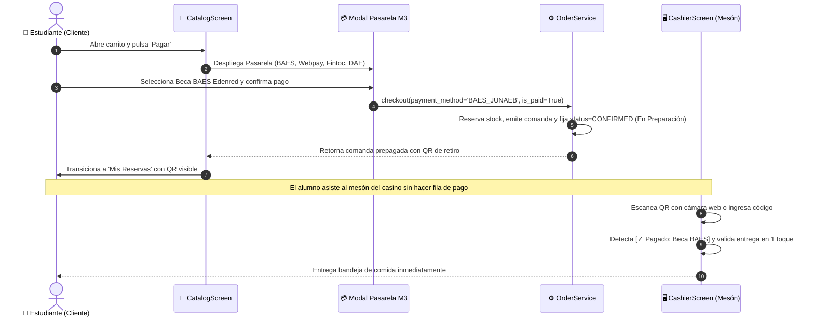
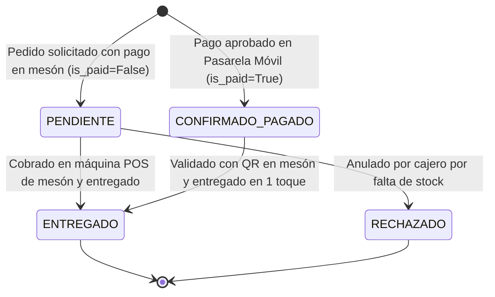

# Especificación Técnica: Pasarela de Pago Seguro Móvil y Retiro Express QR

```yaml
id_feature: "PC-FEAT-006"
nombre: "Pasarela de Pago Móvil Universitario y Retiro Express con QR"
version: "1.0.0"
fecha: "2026-09-28"
estado: "Implementada"
autor: "Antigravity Punto Casino Platform Team"
aprobador_hitl: "Renato Glocker / Arquitecto Líder"
impacto: "Mayor (Modelos, Flujo Transaccional, UI/UX Cliente y Cajero)"
referencia_requerimientos: "docs/requerimientos.md (Secciones 2.1, 2.3 y 3.2)"
referencia_expansion_saas: "docs/plan_expansion_universidades_chile/README.md (Punto 4 e Hito 3)"
```

---

## 1. Resumen Ejecutivo y Valor de Negocio

### 1.1 Declaración del Problema
Tradicionalmente, en los casinos universitarios chilenos, el proceso de pedido presencial o reserva sin cobro previo genera dos cuellos de botella críticos:
1. **Pérdidas Comerciales por Abandono de Comandas**: Si un estudiante reserva un plato y no asiste al casino a pagar, la cocina incurre en mermas económicas irreversibles de alimentos preparados.
2. **Filas Redundantes en Horas Punta**: El estudiante debía hacer fila para confirmar/pagar y otra para retirar su plato, o el cajero debía realizar múltiples confirmaciones intermedias ("Confirmar Cocina", "Listo Cocina"), dilatando el despacho.

### 1.2 Valor Aportado y Métricas de Éxito
- **Eliminación del 100% de Mermas por Abandono**: Al integrar la pasarela de pago directamente en el flujo de confirmación del carrito móvil ("Pagar"), los pedidos confirmados nacen prepagados (`is_paid = True`) con estatus directo a preparación en cocina (`CONFIRMED`).
- **Retiro Express en 1 Toque**: El estudiante llega al casino directamente con su código QR. El cajero escanea con la cámara o ingresa el código y entrega el pedido en un solo toque, suprimiendo los pasos redundantes de cocina y reduciendo el tiempo de atención de 90s a menos de 5s por alumno.
- **Alineación con el Ecosistema Universitario Chileno (Punto 4 Plan de Expansión)**:
  - 🎓 **Beca BAES JUNAEB (Edenred / Pluxee Sodexo)**: Pilar prioritario (>70% de la venta universitaria en Chile).
  - 💳 **Transbank Webpay Plus**: Tarjetas de débito (Redcompra / CuentaRUT) y crédito.
  - ⚡ **Fintoc / Khipu (Open Finance)**: Transferencias electrónicas TEF de baja comisión.
  - 🏛️ **Beca Interna de Alimentación DAE / Mesón**: Para estudiantes becados por la propia universidad o pago presencial.

---

## 2. Arquitectura de Software y Capas del Sistema

```text
punto_casino/
├── models/order.py             # PaymentMethod Enum, PAYMENT_METHOD_LABELS, Order (is_paid, payment_method)
├── repositories/order_repo.py  # Mapeo de persistencia con medios de pago y seeding actualizado
├── services/order_service.py   # checkout(payment_method, is_paid=True) con estatus CONFIRMED inmediato
├── services/cashier_service.py # process_qr_payment con entrega rápida y asignación de medio de cobro POS
├── views/screens/
│   ├── catalog_screen.py       # Botón "Pagar", Pasarela de Pago M3 con 4 medios Punto 4 y navegación
│   ├── cashier_screen.py       # Eliminación de confirmaciones redundantes, entrega 1-touch y selector POS
│   └── reservations_screen.py  # Badge de prepago [✓ Pagado] e instrucciones de retiro express
└── tests/test_domain.py        # Cobertura unitaria de pasarela, prepago y despacho express en mesón
```

---

## 3. Flujo de Datos y Diagrama de Secuencia



---

## 4. Máquina de Estados Finita (FSM)



---

## 5. Diseño de Interfaz y Material Design 3 (M3)

1. **Botón 'Pagar' en Carrito**:
   - Reemplaza el botón ambiguo "Confirmar" por **"Pagar"** con icono `"credit-card"` y estilo `"offer"` (verde fresco `#2EC76E`).
2. **Pasarela de Pago M3**:
   - Tarjeta modal `outlined` (sin sombras negras en SDL2), `radius=dp(16)`.
   - Distintivo central con monto total formateado en CLP (`$X.XXX`).
   - Cuatro tarjetas de selección con microinteracción táctil, borde activo `#0A3871` y fondo `#EFF6FF` con check verde (`#10B981`).
   - Botón primario de confirmación `"Pagar $X.XXX"` que activa la comanda y navega con fluidez a `"reservations"`.
3. **Cola de Mesón Simplificada (Cajero)**:
   - Eliminados definitivamente los botones de "Confirmar Cocina" y "Listo Cocina".
   - Tarjetas compactas (`dp(136)`): un solo nivel de botones.
   - Para pedidos prepagados: botón verde full-width **"Entregar Comanda"** (`style="filled"`).
   - Para pedidos de mesón: selector rápido de terminal POS (Débito POS, BAES, Efectivo) con **"Cobrar en Mesón y Entregar"**.

---

## 6. Verificación y Pruebas Automatizadas

Se agregaron pruebas unitarias en [`tests/test_domain.py`](file:///e:/Rena/ProntoCasino2/tests/test_domain.py) cubriendo:
- `test_order_creation_and_cart_workflow`: Creación de comanda prepagada con estatus `CONFIRMED` y `is_paid=True`.
- `test_payment_gateway_checkout_options`: Verificación de órdenes prepagadas (Webpay Plus) vs órdenes de mesón (Efectivo/POS).
- `test_cashier_fast_delivery_prepaid_comanda`: Despacho y entrega en 1 solo paso de comandas prepagadas vía QR.
- `test_cashier_pos_machine_charge_and_delivery`: Cobro con máquina de tarjeta POS en mesón y entrega simultánea.

Ejecución de validación:
```powershell
.\kivy_env\Scripts\python.exe -m unittest discover -s tests -p "test_*.py" ; Remove-Item -Path "test_punto_casino.db*" -Force -ErrorAction SilentlyContinue
```
Resultado: **9 tests pasados exitosamente en 6.2s, 0 errores.**
