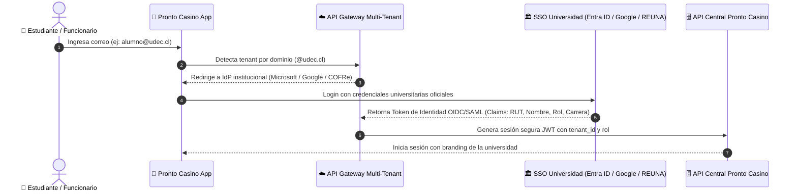

# Plan Estratégico y Técnico: Expansión de Pronto Casino como Plataforma SaaS Multi-Universidad en Chile

- **Fecha**: 2026-09-20
- **Estado**: Planificación y Hoja de Ruta Aprobada
- **Autor / Agente**: Antigravity Punto Casino Architecture Team
- **Referencia Requerimientos**: `docs/requerimientos.md` (Fase 2: Escalabilidad y Despliegue Multi-Campus)

---

## 1. Resumen Ejecutivo y Visión Comercial

El objetivo de esta iniciativa es transformar **Pronto Casino** desde un prototipo funcional mono-institucional (UCT) hacia una **plataforma empresarial B2B (Software as a Service - SaaS)** comercializable a universidades, institutos profesionales y centros de formación técnica a lo largo de Chile (ej: UCT, UdeC, UFRO, PUC, UCh, USACH, UCN, DuocUC, Inacap).

### 1.1 Premisa Fundamental del Ecosistema Universitario Chileno
Las casas de estudios superiores en Chile **no permiten acceso directo a sus bases de datos SQL centrales (Oracle, SQL Server, PostgreSQL, Banner, SAP)** a proveedores externos de software por estrictas razones de gobernanza, seguridad de la información y cumplimiento legal (Ley N° 19.628 de Protección de Datos Personales). 

Por tanto, la conexión con "credenciales reales" de cada universidad debe implementarse mediante **Identidad Federada (Single Sign-On - SSO), estándares abiertos (OAuth 2.0, OpenID Connect, SAML 2.0) y APIs intermedias autorizadas**.

---

## 2. Arquitectura de Conexión e Identidad Universitaria (SSO Real)

### 2.1 Proveedores de Identidad (IdP) Soportados en Chile
1. **Microsoft Entra ID (Azure AD / Office 365)**:
   - Utilizado por el 65%+ de las universidades chilenas (ej: UCT, UdeC, PUC, UAndes, UDD).
   - Protocolo: **OAuth 2.0 / OpenID Connect (OIDC)** mediante `MSAL` (Microsoft Authentication Library).
2. **Google Workspace for Education**:
   - Utilizado por universidades estatales y centros técnicos (ej: USACH, UTFSM, DuocUC, UAH).
   - Protocolo: **Google OAuth 2.0 / OIDC**.
3. **Federación COFRe / REUNA (Red Universitaria Nacional)**:
   - Red de identidad académica nacional de Chile basada en **SAML 2.0 / Shibboleth**. Permite con un solo acuerdo institucional federar el acceso a más de 40 universidades e instituciones científicas chilenas.
4. **Directorios LDAP / Active Directory On-Premise**:
   - Para entidades que manejan autenticación interna tras túneles mTLS o VPN dedicadas.

### 2.2 Atributos Institucionales Obtenidos en Login
- **RUT / Pasaporte**: Identificador único nacional con validación de dígito verificador.
- **Rol en la Universidad**: Estudiante Regular, Académico, Personal Administrativo, Personal de Casino.
- **Carrera / Facultad / Sede**: Permite segmentar casinos disponibles por campus geográfico.
- **Estado de Matrícula**: Bloqueo automático para egresados o matrículas suspendidas.

---

## 3. Arquitectura Multi-Tenant y White-Labeling Dinámico

Para comercializar una sola plataforma de código único a decenas de universidades:

### 3.1 Aislamiento de Datos por Universidad (Multi-Tenancy)
- **Base de Datos Cloud (PostgreSQL)**:
  - **Estrategia Recomendada**: *Schema-per-Tenant* (un esquema independiente por institución: `schema_uct`, `schema_udec`, `schema_ufro`) o *Row-Level Security (RLS)* con columna `tenant_id` inviolable.
  - Se asegura que los datos financieros, listas de alumnos y órdenes de una universidad sean completamente invisibles e inaccesibles para las demás.

### 3.2 Motor de White-Labeling (Marca Dinámica)
La aplicación cliente se personaliza dinámicamente en tiempo de ejecución tras la detección del dominio de la institución:
- **Paleta de Colores Dinámica**:
  - UCT: Navy `#0A3871` y Celeste `#0288D1`.
  - UdeC: Azul Marino `#002D62` y Amarillo `#FDB813`.
  - USACH: Granate `#C8102E` y Naranja institucional.
- **Recursos Gráficos**: Descarga en caché local de logotipos de alta resolución de la universidad y sus concesiones de casino.
- **Multi-Campus y Multi-Casino**:
  - Selección de campus específico (ej. Campus San Francisco, San Juan Pablo II en Temuco; Campus Concepción en UdeC).
  - Selección de casino o cafetería específica dentro de la sede (Casino Central, Kiosco de Biblioteca, Cafetería de Deportes).

---

## 4. Ecosistema de Medios de Pago en Universidades Chilenas

Para que la aplicación sea comercialmente viable frente a los concesionarios (Sodexo, Compass, Aramark o privados locales):

| Medio de Pago | Importancia Comercial | Mecanismo de Integración |
| :--- | :--- | :--- |
| **Beca BAES JUNAEB** (Edenred / Pluxee Sodexo) | **Indispensable (representa >70% de ventas)** | Integración con API de comercios asociados de Edenred y Pluxee para validación de saldo y pago mediante lectura de código dinámico. |
| **Transbank Webpay Plus** | Alta (Tarjetas de Débito/Crédito) | Webpay Plus REST con soporte de tokenización OneClick para compras en un solo toque. |
| **Fintoc / Khipu** (Open Finance) | Alta (Comisiones reducidas) | Transferencias electrónicas directas cuenta a cuenta (TEF) mediante Open Banking chileno. |
| **Beca Interna de Alimentación Universitaria** | Media-Alta | Sincronización con la Dirección de Asuntos Estudiantiles (DAE) para estudiantes becados por la propia casa de estudios. |

---

## 5. Hardware de Casino, Cocina (KDS) y Operación en Salón

1. **Pantalla Turnero en Salón (Smart TV)**:
   - Vista web liviana conectada por **WebSockets** que se proyecta en televisores del casino, organizada en:
     - **En Preparación**: Comandas activas en ámbar.
     - **Listo para Retirar**: Comandas preparadas en verde con sonido de alerta.
2. **Kitchen Display System (KDS)**:
   - Panel táctil para cocina donde los pedidos se agrupan por plato y tiempo transcurrido, optimizando los tiempos de preparación en horas punta.
3. **Impresión Térmica Directa (ESC/POS)**:
   - Emisión de comandas físicas en impresoras de 58mm/80mm por USB, Bluetooth o Red Ethernet para el personal de mesón.
4. **Facturación Electrónica SII (Chile)**:
   - Integración con API de facturación electrónica (ej: OpenFactura, Bsale o Haulmer) para emisión de boleta electrónica obligatoria.

---

## 6. Seguridad y Cumplimiento Normativo

1. **Ley N° 19.628 de Protección de la Vida Privada** y nueva regulación de la Agencia de Protección de Datos Personales de Chile.
2. **Cifrado Obligatorio**:
   - En tránsito: **TLS 1.3** con mTLS entre servicios.
   - En reposo: **AES-256** para bases de datos y respaldos.
3. **Pistas de Auditoría Inmutables**:
   - Logs de cada transacción financiera, cambio de stock, anulación y cobro con firma criptográfica.

---

## 7. Hoja de Ruta de Implementación

### Hito 0 (Inmediato): Pulido Integral de UX de la Aplicación Base
Antes de desplegar infraestructura cloud y módulos de backend distribuidos, es imperativo elevar al máximo la calidad de la aplicación actual:
- [ ] Auditoría y pulido de cada pantalla móvil (Login, Menús, Carrito, Reservas, Caja, Admin).
- [ ] Fluidez en microinteracciones, transiciones de pantalla y accesibilidad táctil/teclado.
- [ ] Prevención de desbordamientos de texto en cualquier tamaño de pantalla de smartphone.
- [ ] Retroalimentación visual enriquecida (loaders, diálogos de estado y confirmaciones con sonido/animación suave).

### Hito 1: Desacoplamiento Cliente-Servidor y Backend Cloud (FastAPI + PostgreSQL)
- [ ] Construcción del backend REST/WebSocket en Python con FastAPI y PostgreSQL.
- [ ] Reemplazo de repositorios locales por clientes HTTP autenticados por JWT.
- [ ] WebSockets para sincronización en tiempo real entre cliente, caja y cocina.

### Hito 2: Broker de Identidad Universitaria (SSO) y Multi-Tenancy
- [ ] Módulo OAuth 2.0 / OIDC para Microsoft Entra ID y Google Workspace for Education.
- [ ] Conector SAML 2.0 para federación REUNA COFRe.
- [ ] Motor de personalización de temas institucional dinámico.

### Hito 3: Integración de Pagos y Hardware
- [ ] Pasarela Webpay Plus y Fintoc.
- [ ] API de convenio BAES JUNAEB (Edenred / Pluxee).
- [ ] Pantalla web de Turnero TV para proyectar en salón.
- [ ] Protocolo ESC/POS para impresoras térmicas de tickets.

### Hito 4: Piloto Comercial en Terreno
- [ ] Despliegue piloto en un casino universitario real.
- [ ] Medición de reducción de tiempos de espera en filas y satisfacción de estudiantes.

