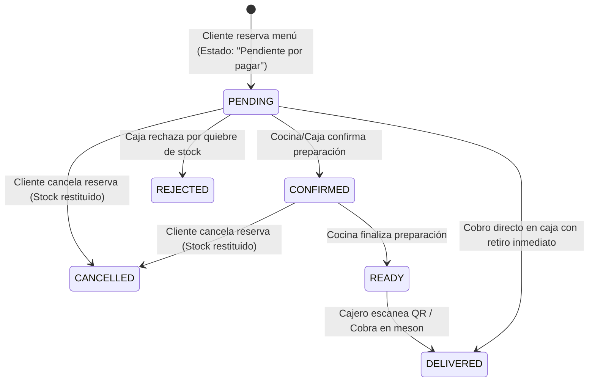

# Feature: Códigos QR de Retiro en Alta Definición, Lector QR Eficiente con OpenCV y Flujo de Cobro

- **Fecha**: 2026-09-17
- **Estado**: Completada y Verificada
- **Autor / Responsable**: Antigravity Punto Casino Engineer
- **Referencia a Requerimientos**: [docs/requerimientos.md](../requerimientos.md) (Sección 1.1, 1.2, 2.1 y Flujo Operacional de Casino)

---

## 1. Descripción y Objetivo
Esta funcionalidad implementa el ciclo completo de entrega y retiro rápido de pedidos en el casino de la Universidad Católica de Temuco (UCT):
1. **Identificación Explícita de Reserva Pendiente**: Las reservas de comanda en cola muestran explícitamente el estado **"Pendiente por pagar"** con distintivo ámbar de alerta (`#D97706`).
2. **Código QR Agrando en Alta Definición**: En `ReservationsScreen`, el código QR se amplió a `size=(dp(216), dp(216))` con textura generada en `box_size=12` y `border=3`, enmarcado en una tarjeta limpia con bordes suaves que facilita el escaneo a distancia desde cámaras y teléfonos móviles.
3. **Lector QR Efectivo y Eficiente con OpenCV**: En `CashierScreen`, se integró un módulo escáner en tiempo real respaldado por `cv2.QRCodeDetector()` de OpenCV:
   - **Cámara en Vivo**: Captura frames de webcam en segundo plano a 20 FPS, detectando y decodificando el código QR en milisegundos de forma no bloqueante.
   - **Detección Automática**: Al detectar un QR válido, detiene la cámara de inmediato, autocompleta el código de la comanda y la verifica en pantalla.
   - **Simulación y Fallback Manual**: Permite probar la decodificación OpenCV con un solo clic sobre comandas activas o ingresar códigos manualmente con pistolas de códigos de barra.
   - **Liberación Segura de Recursos**: Garantiza el cierre y liberación del dispositivo de cámara (`cap.release()`) al ocultar el modal o cambiar de pantalla.
4. **Cancelación Segura de Reserva**: Los clientes pueden cancelar comandas en estado `PENDING` o `CONFIRMED` antes de su retiro, restituyendo automáticamente el stock de platos a la cocina.

---

## 2. Tecnicismos y Mecánica de Funcionamiento

### 2.1 Arquitectura y Módulos
- **Modelos (`punto_casino/models/order.py`)**:
  - Estado `OrderStatus.CANCELLED = "CANCELLED"`.
  - Mapeo de etiquetas legibles `ORDER_STATUS_LABELS` (`PENDING` $\rightarrow$ `"Pendiente por pagar"`, etc.).
  - Paleta cromática de estados `ORDER_STATUS_COLORS`.
- **Utilidades (`punto_casino/utils/qr_generator.py`)**:
  - `generate_pickup_payload(order_id, customer)`: Codifica el payload estructurado JSON para validación en caja.
  - `generate_qr_texture(payload)`: Renderiza el código QR directamente en una textura OpenGL de Kivy (`CoreImage.texture`) en memoria usando `io.BytesIO`, evitando escrituras residuales en disco.
  - `parse_pickup_payload(payload)`: Decodifica de forma segura payloads JSON o identificadores directos de pedido.
- **Servicios (`punto_casino/services/`)**:
  - `OrderService.cancel_order(order_id)`: Valida elegibilidad de cancelación, incrementa el stock de cada producto en inventario y actualiza el estado a `CANCELLED`.
  - `CashierService.process_qr_payment(qr_input)`: Valida el código escaneado, verifica que la comanda no esté cancelada ni previamente cobrada, y efectúa la transición a `DELIVERED`.
- **Vistas / UI (`punto_casino/views/screens/`)**:
  - `ReservationsScreen`: Tarjetas de reservas con botón "Ver QR y Detalle", modal dinámico con imagen de textura QR, desglose monetario y confirmación de cancelación.
  - `CashierScreen`: Botón principal "📷 Escanear QR", atajos para comandas activas, verificación de ítems y botón de ejecución "Cobrar y Entregar".

### 2.2 Flujo de Datos y Transiciones de Estado


### 2.3 Componentes KivyMD & Diseño
- Inyección limpia de modales: para prevenir el error de Kivy `OpenGL FBO Incomplete Attachment (36054)` originado al asignar `height=dp(0)` a tarjetas elevadas, los modales se añaden dinámicamente al layout principal con `root_layout.add_widget(modal, index=1)` y se retiran mediante `root_layout.remove_widget(modal)`.
- Diseño limpio y responsivo con bordes redondeados (`radius=dp(14)` a `dp(18)`), tipografía jerárquica y contraste institucional UCT.

---

## 3. Casos Borde y Manejo de Errores
- **Cancelación de Pedidos ya Entregados**: El servicio previene cancelar pedidos en estados terminales (`DELIVERED`, `CANCELLED`, `REJECTED`).
- **QR Inválido o Malformado**: El escáner de caja captura excepciones `json.JSONDecodeError` y valida la existencia del identificador en el repositorio, entregando retroalimentación visual al cajero.
- **Doble Cobro**: Si una comanda ya fue entregada, el escáner notifica que la comanda ya fue cobrada previamente impidiendo inconsistencias contables.
- **Restitución Atómica de Inventario**: Al cancelar, cada línea de pedido (`OrderItem`) suma exactamente su cantidad reservada al producto correspondiente.

---

## 4. Pruebas y Verificación

### Comando de ejecución local
```bash
./kivy_env/bin/python main.py
```

### Script de Verificación Automatizada
```bash
DISPLAY=:0.0 ./kivy_env/bin/python -c '
from punto_casino.models.order import OrderStatus, ORDER_STATUS_LABELS
from punto_casino.repositories.database import DatabaseManager
from punto_casino.repositories.user_repository import UserRepository
from punto_casino.repositories.product_repository import InMemoryProductRepository
from punto_casino.repositories.order_repository import InMemoryOrderRepository
from punto_casino.services.auth_service import AuthService
from punto_casino.services.order_service import OrderService
from punto_casino.services.cashier_service import CashierService
from punto_casino.utils.qr_generator import generate_qr_texture

# Inicializar servicios
db = DatabaseManager()
user_repo = UserRepository(db)
prod_repo = InMemoryProductRepository()
order_repo = InMemoryOrderRepository()
auth_service = AuthService(user_repo)
order_service = OrderService(prod_repo, order_repo, auth_service)
cashier_service = CashierService(prod_repo, order_repo, auth_service)

# 1. Login y reserva
auth_service.authenticate_credentials("renato@uct.cl", "Renato2026!")
order_service.add_to_cart("MENU-01", 1)
order = order_service.checkout()
assert ORDER_STATUS_LABELS[order.status] == "Pendiente por pagar"

# 2. Generación QR
assert generate_qr_texture(order.pickup_qr) is not None

# 3. Cancelación
assert order_service.cancel_order(order.id_pedido) is True

# 4. Cobro por escáner de caja
order2 = order_service.checkout() if order_service.add_to_cart("MENU-02", 1) is None else None
ok, msg, _ = cashier_service.process_qr_payment(order2.pickup_qr)
assert ok is True
print("Verificación de QR, estados y caja exitosa!")
'
```

### Checklist de Verificación Funcional
- [x] El distintivo en la lista de reservas indica explícitamente **"Pendiente por pagar"** en color ámbar.
- [x] Al pulsar "Ver QR y Detalle" se despliega el modal con los platos, total a pagar en casino y el código QR de retiro.
- [x] El botón "Cancelar Reserva" solicita confirmación y restituye el stock en cocina al aceptarse.
- [x] La pantalla de caja dispone del botón "📷 Escanear QR" y del botón "Cobrar (QR)" en cada comanda.
- [x] El cajero puede previsualizar los ítems escaneados y cobrarlos marcándolos como pagados y entregados.

