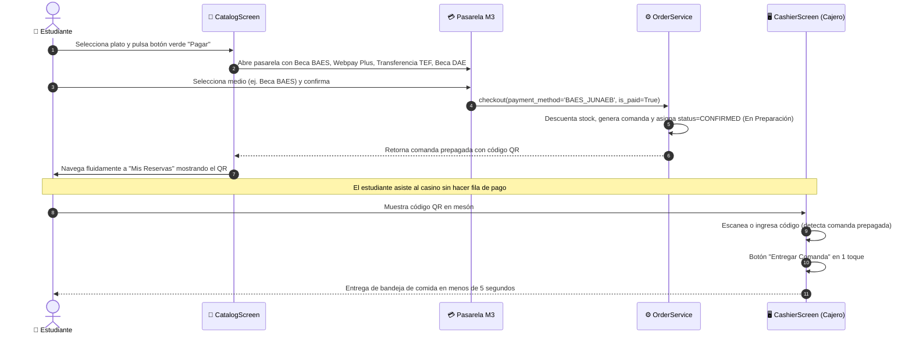

# MEMORY.MD — Punto Casino Universidad (SaaS Chile)

> **Documento Vivo de Estado, Arquitectura, Decisiones de Diseño y Memoria Persistente del Proyecto.**  
> *Última actualización: 2026-10-02 | Rama activa: `main` | Entorno: Windows 11 + Python 3.13 (`kivy_env`)*

---

## 1. Visión del Producto y Contexto de Negocio

**Punto Casino Universidad** es una plataforma móvil y de gestión para casinos, cafeterías y concesiones en instituciones de educación superior en Chile (universidades CRUCH/privadas, institutos profesionales y centros de formación técnica como UCT, UdeC, UFRO, PUC, UCh, USACH, DuocUC, Inacap).

### 1.1 Problemas Clave Resueltos
1. **Filas y aglomeraciones en horas punta (12:00 - 14:30 hrs)**: Los estudiantes reservan y compran desde su teléfono, retirando en mesón con código QR en menos de 5 segundos.
2. **Pérdidas operacionales por abandono de comandas**: El flujo de compra móvil incluye pasarela de pago obligatoria ("Pagar"). Las comandas pagadas nacen en estado `CONFIRMED` (`is_paid = True`) y pasan directo a preparación en cocina, eliminando el desperdicio de comida.
3. **Múltiples pasos redundantes de cajero**: Se suprimieron botones intermedios ("Confirmar Cocina", "Listo Cocina"). Al leer el QR de una comanda pagada, se entrega con un solo toque ("Entregar Comanda").
4. **Desconexión con el ecosistema universitario chileno**: Integración con Beca BAES JUNAEB (Edenred / Pluxee Sodexo, >70% de la venta estudiantil), Transbank Webpay Plus (débito/crédito/CuentaRUT), transferencias bancarias TEF (Fintoc / Khipu) y becas internas DAE.

---

## 2. Pila Tecnológica y Entorno de Ejecución

- **Lenguaje**: Python 3.13 (compatible 3.10+)
- **Entorno Virtual**: `.\kivy_env\Scripts\python.exe` (Windows PowerShell)
- **Framework UI/UX**: Kivy 2.3.0 + KivyMD 2.0.1 (Material Design 3)
- **Motor de Renderizado**: SDL2 / OpenGL (diseñado con tolerancia a aceleración por software Mesa/ANGLE)
- **Base de Datos**: SQLite 3 con modo WAL (`PRAGMA journal_mode=WAL; PRAGMA foreign_keys = ON;`), transacciones atómicas y consultas parametrizadas.
- **Códigos QR**: Generación de textura en memoria (`BytesIO` + Pillow + qrcode), sin archivos temporales en disco.
- **Control de Versiones**: Git sobre `https://github.com/renaglock/ProntoCasino2.git` (rama `main`).

### 2.1 Comandos Operacionales Clave
```powershell
# Ejecutar suite de pruebas unitarias con limpieza garantizada de base de datos temporal:
.\kivy_env\Scripts\python.exe -m unittest discover -s tests -p "test_*.py" ; Remove-Item -Path "test_punto_casino.db*" -Force -ErrorAction SilentlyContinue

# Lanzar la aplicación en modo desarrollo:
.\kivy_env\Scripts\python.exe main.py
```

---

## 3. Arquitectura del Código (Clean Layered Architecture)

```text
e:\Rena\ProntoCasino2\
├── main.py                             # Punto de entrada, ventana 380x720dp, orquestación de pantallas
├── punto_casino.db                     # Base de datos SQLite local en modo WAL
├── requirements.txt                    # Dependencias congeladas del proyecto
├── punto_casino/
│   ├── core/
│   │   └── config.py                   # Constantes de tema, colores UCT (#0A3871, #2EC76E), rutas
│   ├── models/
│   │   ├── user.py                     # User, UserRole (CLIENT, CASHIER, ADMIN, GUEST)
│   │   ├── product.py                  # Product (id_producto, name, category, price, stock, is_offer)
│   │   └── order.py                    # Order, OrderItem, OrderStatus, PaymentMethod, labels y colores
│   ├── repositories/
│   │   ├── database.py                 # DatabaseManager con SQLite WAL y auto-migraciones
│   │   ├── user_repository.py          # CRUD y autenticación de usuarios con hashing PBKDF2
│   │   ├── product_repository.py       # Persistencia de catálogo e inventario
│   │   └── order_repository.py         # Persistencia de comandas y numeración diaria correlativa
│   ├── services/
│   │   ├── auth_service.py             # Sesión activa, login, registro, logout, quick_login
│   │   ├── order_service.py            # Carrito en memoria, validación de stock, checkout pagado
│   │   ├── cashier_service.py          # Cola de comandas, validación QR, cobro POS y entrega 1-touch
│   │   └── security.py                 # Hashing seguro, verificación de RUT chileno (módulo 11)
│   ├── utils/
│   │   ├── formatters.py               # Formateo de moneda nacional ($X.XXX CLP) y fechas
│   │   └── qr_generator.py             # Generación de textura de código QR sin escritura en disco
│   └── views/
│       ├── styles.kv                   # Reglas KV de Material Design 3
│       ├── components/                 # Componentes reutilizables (M3NavItem, botones, tarjetas)
│       └── screens/
│           ├── auth_screen.py          # Pantalla de acceso y registro de usuarios
│           ├── catalog_screen.py       # Catálogo con ofertas, carrito y pasarela de pago M3
│           ├── reservations_screen.py  # Historial de reservas del estudiante y QR de retiro express
│           ├── cashier_screen.py       # Pantalla de mesón con cola en vivo, lector QR y cobro POS
│           └── admin_screen.py         # Dashboard contable KPI, gestión de catálogo y auditoría
├── tests/
│   └── test_domain.py                  # 9 pruebas unitarias completas de modelos, servicios y flujos
└── docs/                               # Documentación técnica por característica (TEMPLATE_FEATURE.md)
```

---

## 4. Matriz de Roles y Permisos

| Rol | Identificador | Capacidades del Sistema | Caso de Uso Universitario |
| :--- | :--- | :--- | :--- |
| **Cliente** | `client` | Ver menú, agregar al carrito, pagar vía pasarela móvil (BAES, Webpay, TEF, DAE), recibir QR de comanda, revisar historial. | Alumno regular, profesor, funcionario con cuenta. |
| **Invitado** | `guest` | Navegar catálogo, pagar en pasarela móvil sin registro previo obligatorio, obtener QR temporal. | Visitante de campus o alumno sin login. |
| **Cajero** | `cashier` | Visualizar cola de comandas en vivo, escanear/ingresar código QR, entregar pedidos pagados en 1 toque, cobrar pedidos presenciales vía POS, conmutar stock. | Personal de mesón y atención de casino. |
| **Administrador** | `admin` | Capacidades de cajero + edición de platos y precios, activación de ofertas/descuentos, métricas contables (KPIs, gráficos por categoría), auditoría completa. | Jefe de casino / Administrador de concesión. |
| **SuperAdmin** | `superadmin` | Gestión multi-universidad (`tenant_id`), campus y configuración de federación de identidad (SSO). | Administrador corporativo SaaS. |

---

## 5. Reglas de Diseño UI/UX y Estándares Material Design 3 (M3)

Para evitar regresiones visuales y asegurar una experiencia de estándar empresarial:

1. **Resolución Estándar**: Viewport móvil de **380 x 720 dp** (mínimo soportado 360 x 640 dp).
2. **Cero Sombras Negras (Software OpenGL Resilience)**:
   - **Nunca** usar `style="elevated"` con `elevation > 0` (provoca polígonos negros opacos en drivers Mesa/SDL2).
   - Utilizar siempre `style="outlined"`, `elevation=0`, `line_color=[0.88, 0.92, 0.96, 1]` (`#DFEAF2`) y fondo blanco explícito `theme_bg_color="Custom"`.
3. **Barra de Navegación (`M3NavItem`)**:
   - Captura táctil sobre toda el área con `on_touch_down`/`on_touch_up`.
   - Línea indicadora superior esbelta de 3dp (`#0A3871`) en pestaña activa.
   - Jamás embeber tarjetas `MDCard` dentro de los ítems de navegación (evita el efecto visual de "interruptor descentrado").
4. **Descripciones de Vista Fijas Arriba**:
   - El texto explicativo o de estado de la pantalla (`status_label` / descripción de vista) debe permanecer **anclado en la parte superior** bajo el encabezado, jamás desplazado bajo tabs o dentro de scrollbars.
5. **Modales Limpios y Ergonomía Táctil**:
   - Cuando se abre un modal de cobro, detalle o pasarela, el scroll de fondo se apaga (`opacity=0`, `disabled=True`) para evitar solapamientos o toques accidentales.
   - Alturas explícitas (`dp`) en contenedores para prevenir el fallo *OpenGL FBO Incomplete Attachment (36054)*.
6. **Cero Saturación Visual (Sin Paréntesis Técnicos)**:
   - Formato estándar de estado: `✓ Pagado • Beca BAES`, `✓ Pagado • Webpay Plus`.
   - Se eliminaron paréntesis explicativos o menciones a porcentajes de mercado en la UI del usuario.
7. **Dimensiones de Botones en KivyMD 2.0**:
   - Siempre especificar `theme_width="Custom"` y `theme_height="Custom"` al asignar `size_hint` o tamaños explícitos a `MDButton`.

---

## 6. Características Implementadas y Estado de Documentación

| Código | Característica | Estado | Ubicación Técnica |
| :--- | :--- | :--- | :--- |
| **PC-FEAT-001** | Mobile UI, Autenticación y Roles | ✅ Producción | [`docs/mobile_ui_and_auth/README.md`](file:///e:/Rena/ProntoCasino2/docs/mobile_ui_and_auth/README.md) |
| **PC-FEAT-002** | Base de Datos SQLite WAL y Seguridad OWASP | ✅ Producción | [`docs/security_and_database/README.md`](file:///e:/Rena/ProntoCasino2/docs/security_and_database/README.md) |
| **PC-FEAT-003** | Generación QR de Retiro y Mis Reservas | ✅ Producción | [`docs/qr_pickup_and_reservations/README.md`](file:///e:/Rena/ProntoCasino2/docs/qr_pickup_and_reservations/README.md) |
| **PC-FEAT-004** | Productos en Oferta y Promociones Dinámicas | ✅ Producción | [`docs/discounted_products_and_offers/README.md`](file:///e:/Rena/ProntoCasino2/docs/discounted_products_and_offers/README.md) |
| **PC-FEAT-005** | Dashboard Contable, KPIs y Gráficos de Categoría | ✅ Producción | [`docs/accounting_charts_and_order_history/README.md`](file:///e:/Rena/ProntoCasino2/docs/accounting_charts_and_order_history/README.md) |
| **PC-FEAT-006** | Pasarela de Pago Universitario y Despacho Express QR | ✅ Producción | [`docs/pasarela_pago_y_entrega_express_qr/README.md`](file:///e:/Rena/ProntoCasino2/docs/pasarela_pago_y_entrega_express_qr/README.md) |
| **REF-DOC** | Plan de Expansión SaaS Universidades de Chile | 📌 Base | [`docs/plan_expansion_universidades_chile/README.md`](file:///e:/Rena/ProntoCasino2/docs/plan_expansion_universidades_chile/README.md) |
| **REF-DOC** | Requerimientos Originales del Sistema | 📌 Base | [`docs/requerimientos.md`](file:///e:/Rena/ProntoCasino2/docs/requerimientos.md) |
| **REF-DOC** | Plantilla Maestra de Especificación Técnica | 📌 Base | [`docs/TEMPLATE_FEATURE.md`](file:///e:/Rena/ProntoCasino2/docs/TEMPLATE_FEATURE.md) |

---

## 7. Flujo Transaccional Actual (End-to-End)



---

## 8. Protocolo de Trabajo HITL y Disciplina Git

1. **Protocolo HITL Obligatorio**:
   - Todo cambio arquitectónico o de código debe presentarse previamente mediante el bloque estandarizado `🛡️ Human-in-the-Loop (HITL) Code Verification Checkpoint`.
2. **Cero Archivos Basura en el Repositorio**:
   - Nunca dejar archivos temporales de base de datos (`test_punto_casino.db*`).
   - Nunca capturar ni commitear capturas de pantalla de prueba (`screenshot_*.png`).
   - El árbol de trabajo de Git debe mantenerse siempre limpio tras cada tarea.
3. **Verificación Pre-Commit**:
   - Ejecutar la suite de pruebas unitarias (`test_domain.py`). Los 9 tests deben arrojar `OK` antes de cualquier commit o push.
4. **Documentación Obligatoria**:
   - Cada nueva funcionalidad debe incorporar su especificación técnica en `docs/<nombre_feature>/README.md` alineada con `docs/TEMPLATE_FEATURE.md`.

---

## 9. Próximos Pasos en el Roadmap (Backlog Priorizado)

1. **Integración con Webhooks Simulados de Pago**:
   - Simulación de respuesta asíncrona de API Edenred/Pluxee y Transbank Webpay Plus (mock server con tiempos de respuesta realistas de 1.5s).
2. **Sincronización de Beneficiarios DAE**:
   - Carga y verificación de nómina institucional de estudiantes con beca de alimentación 100% subvencionada por la Dirección de Asuntos Estudiantiles.
3. **Alertas en Tiempo Real (Push / WebSockets)**:
   - Notificación sonora y visual al estudiante cuando el personal de cocina marca un pedido de `CONFIRMED` a `READY` (Listo para retiro).
4. **Soporte Multi-Campus / Multi-Concesión**:
   - Selector institucional de sede universitaria (ej. Campus San Francisco UCT vs Campus Menchaca Lira) con inventarios y menús segmentados.
